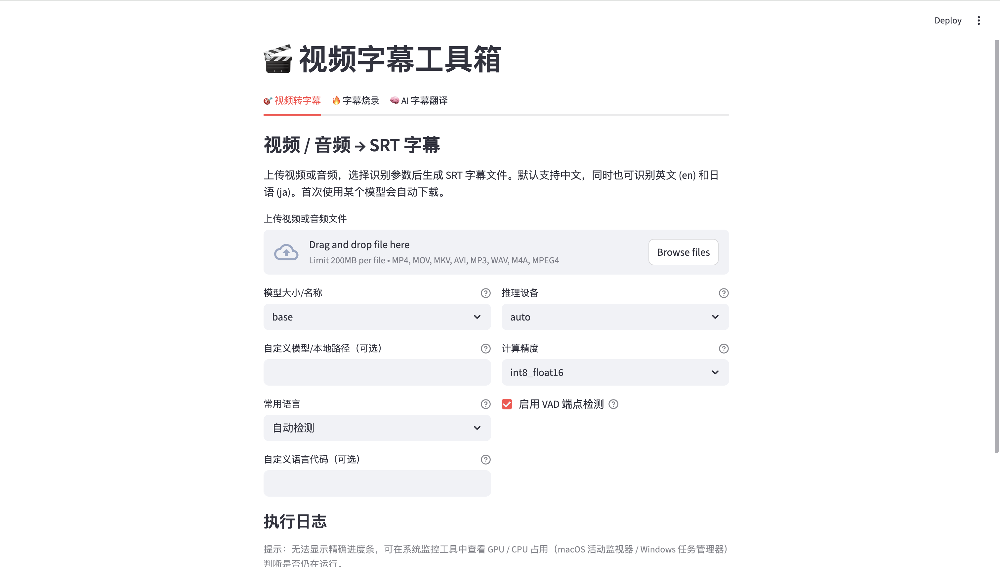
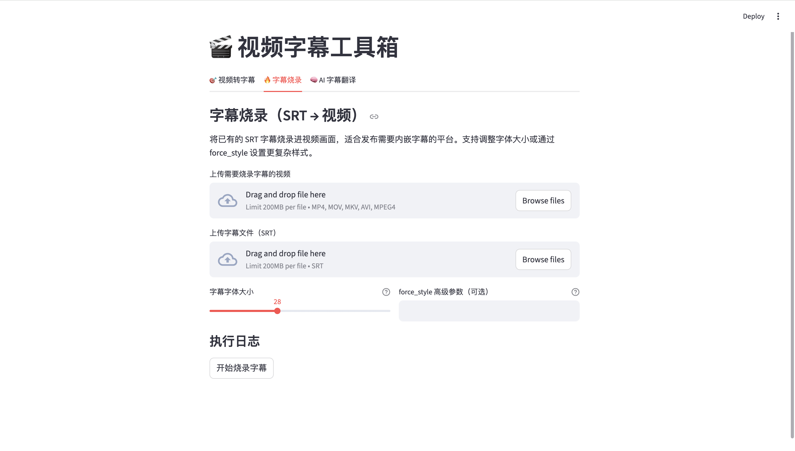

# 视频字幕工具箱使用指南

📘 [English guide](README.en.md)

本项目提供基于 faster-whisper 的 **视频转字幕**、基于 ffmpeg 的 **字幕烧录**，以及基于 OpenAI 模型的 **AI 字幕翻译**。既可以在命令行中运行，也可以通过 Streamlit Web 页面操作。

## Streamlit 界面一览

下图展示 Streamlit 应用三个 Tab 的典型 UI，可直接在 GitHub 或任何支持 Markdown 的平台上预览。






## 1. 环境准备

1. macOS / Linux / Windows（CLI 部分），示例以 macOS 为主。  
2. 安装 Python 3.9+，并准备虚拟环境：
   ```bash
   python3 -m venv venv
   source venv/bin/activate
   ```
3. 安装依赖：
   ```bash
   pip install -r requirements.txt
   ```
   如果没有 requirements，可执行：
   ```bash
   pip install faster-whisper streamlit openai
   ```
4. 安装 ffmpeg（用于提取音频、烧录字幕）：
   ```bash
   brew install ffmpeg      # macOS
   # 或者从 https://ffmpeg.org/ 下载二进制
   ```
5. 首次运行会自动从 Hugging Face 下载安装模型，默认缓存目录为 `~/.cache/huggingface/hub`。

## 2. 命令行模式（mian.py）

1. 基本用法：
   ```bash
   python mian.py /path/to/video.mp4 \
       --model-size base \
       --language zh \
       --device auto \
       --compute-type float32
   ```
2. 常用参数：
   - `--model-size`：faster-whisper 模型名称或本地路径（tiny/base/small/medium/large-v3）。
   - `--language`：ISO 639-1 语言代码，如 `zh`、`en`、`ja`；为空时自动检测。
   - `--device`：`auto` / `cpu` / `cuda` / `metal`。
   - `--compute-type`：`int8_float16` / `int8` / `float16` / `float32`（兼容性最好）。
   - `--no-vad`：取消静音检测。
3. 输出：与输入视频同目录生成 `.srt` 字幕文件。

## 3. Streamlit Web 界面

1. 启动：
   ```bash
   streamlit run streamlit_app.py
   ```
2. 页面包含三个 Tab：

   | 功能 | 说明 |
   | --- | --- |
   | 🎯 视频转字幕 | 上传视频/音频，选择模型和语言，实时日志展示提取音频、模型下载、识别过程，可下载 SRT 并预览。|
   | 🔥 字幕烧录 | 上传视频 + SRT，设置字体或 `force_style`，调用 ffmpeg 生成嵌入字幕的视频，支持进度条和日志。|
   | 🧠 AI 字幕翻译 | 上传 SRT，填写 OpenAI 接口地址和 Key，选择模型与目标语言，按小批量请求翻译并导出新的 SRT。|

3. AI 翻译说明：
   - 需要兼容 OpenAI 格式的接口，例如官方 API 或第三方代理。
- `API Base` 形如 `https://api.openai.com/v1`，`API Key` 只在本次会话中使用。
- `模型名称` 可填写 `gpt-4o-mini`、`gpt-4o-mini-translation` 等。
- `每批翻译的字幕条数` 以及“并发请求数”都可在页面中调节，方便在速度与稳定性之间平衡。

## 4. 常见问题

1. **模型下载太慢/无进度**：日志会提示“加载 / 下载模型”，但没有详细百分比。可提前使用 Hugging Face CLI 下载模型，并在 CLI 的 `--model-size` 或 Web 界面“自定义模型/本地路径”中填入本地目录以避免重复下载。
2. **`ffmpeg failed to extract audio`**：输入视频可能没有音频流。可先用 `ffprobe your_video.mp4` 检查是否存在 `Stream #0:1: Audio`；若无须重新生成带音轨的视频。
3. **`Requested int8_float16 compute type...`**：当前设备不支持 `int8_float16`。改用 `--compute-type float32` 或 `int8`。
4. **代理环境提示缺少 socksio**：安装 `pip install "httpx[socks]"`，确保 httpx 支持 SOCKS 代理。
5. **未安装 ffmpeg**：在 macOS 上执行 `brew install ffmpeg`（或对应平台的安装方式）。

## 5. 目录结构（关键文件）

```
.
├── mian.py              # CLI 主入口
├── streamlit_app.py     # Web 页面
├── requirements.txt     # 依赖列表
├── README.md            # 使用说明（本文档）
└── venv/                # 虚拟环境（可选）
```

如有更多需求（例如批量处理、字幕样式模板、自定义 AI 提示词等），可以基于现有代码继续扩展。欢迎反馈使用体验！

## 许可证

本项目采用 [GNU GPLv3](./LICENSE) 开源协议，欢迎在遵守协议的前提下自由使用、复制与修改代码。
